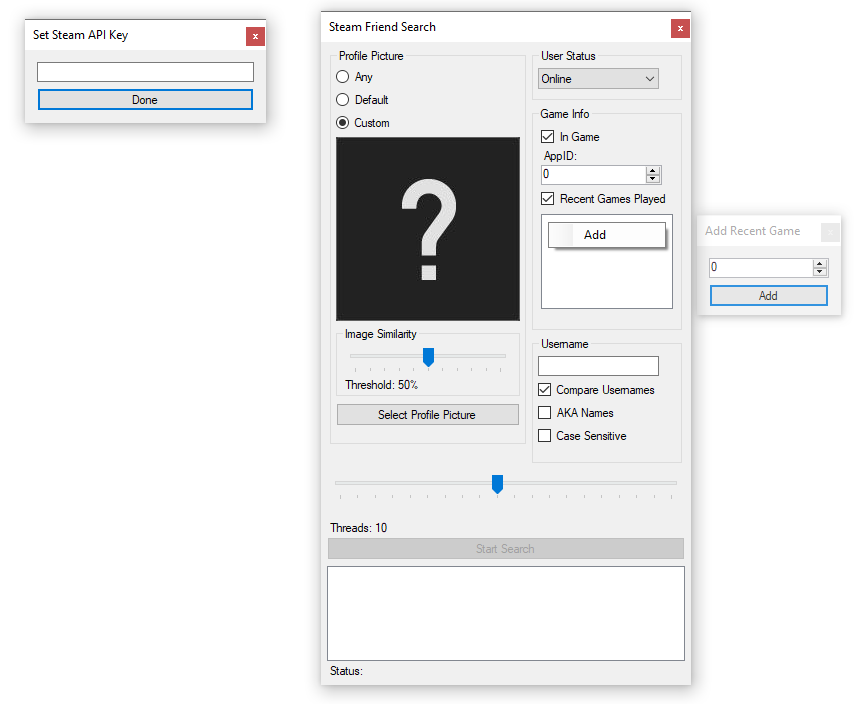

# SteamFriendSearcher

A library to save Steam user information from the Steam community search, and an example application utilizing the library to find specific users based on limited information.

## Requirements
(When building everything will be installed through NuGet)

SteamFriendSearch:
* [NetStandard.Library](https://dot.net)
* [HtmlAgilityPack](https://github.com/zzzprojects/html-agility-pack)
* [Newtonsoft.Json](https://github.com/JamesNK/Newtonsoft.Json)

SteamFriendSearchApp:
* [Emgu.CV](https://github.com/emgucv/emgucv/)
* [Emgu.CV.Bitmap](https://github.com/emgucv/emgucv/)
* [Emgu.CB.runtime.windows](https://github.com/emgucv/emgucv/)
* [HtmlAgilityPack](https://github.com/zzzprojects/html-agility-pack)
* [SteamWebAPI2](https://github.com/babelshift/SteamWebAPI2)

## Example App Screenshot


## Example Library Usage
```cs
PageRequest pageRequest = new PageRequest();
ResultPage resultPage = await pageRequest.GetPageUsersAsync(username, pageNumber).ConfigureAwait(false);
if (resultPage.Success)
{
    foreach (User user in resultPage.Users)
    {
        // Process users
    }
}
```